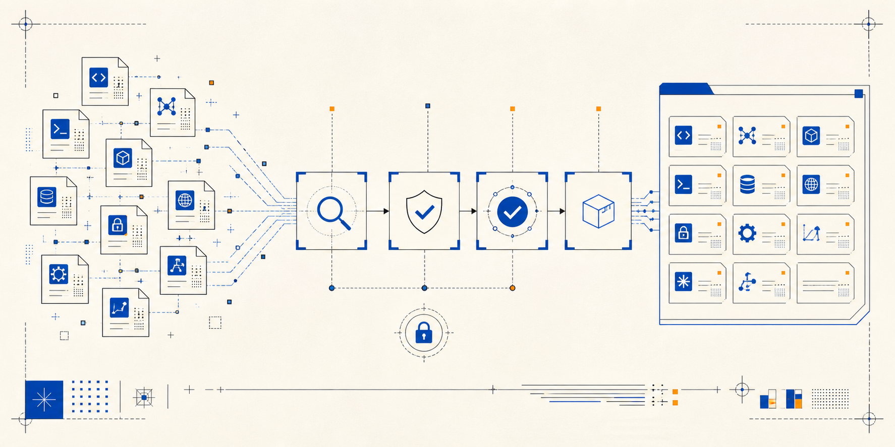
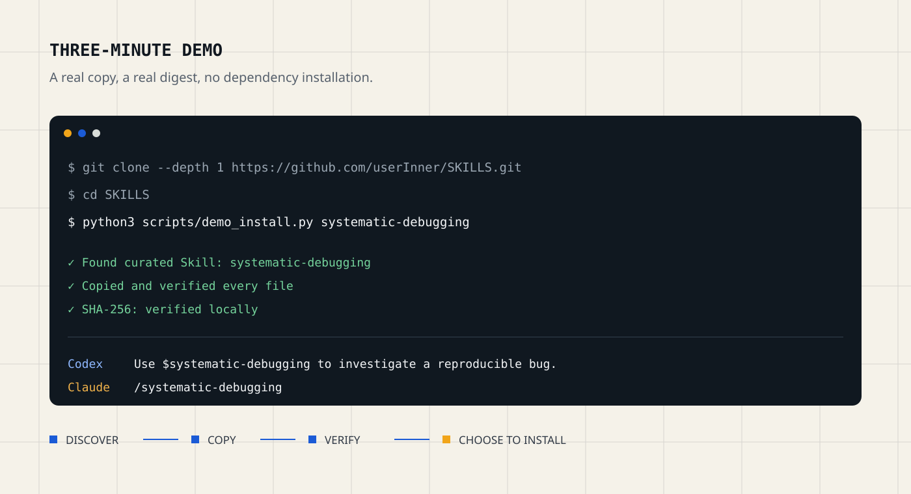

# Agent Skills Index

面向 Codex、Claude Code 和兼容 Agent 的开放 Skill 索引：发现公开来源，拆分具体能力包，记录许可证与来源 Commit，经过静态检查和隔离复制后，再决定是否安装。

当前提供 **7 个分类、41 个直装 Skill**，同时维护每日更新的高星来源索引。第三方内容只有在许可证清楚、依赖资源完整、可脱离原仓库运行时，才会进入直装目录。

[](LICENSE)
[](https://github.com/userInner/SKILLS/actions/workflows/validate-community-skills.yml)
[](https://github.com/userInner/SKILLS/actions/workflows/verify-registry-skills.yml)
[](.github/workflows/update-skill-ranking.yml)

**[3 分钟体验](#3-分钟体验)** · **[安装到 Codex / Claude Code](#安装)** · **[浏览 Skill](#从这些-skill-开始)** · **[信任模型](#不只是-awesome-list)** · **[路线图](ROADMAP.md)** · **[提交试用反馈](https://github.com/userInner/SKILLS/issues/new?template=product-feedback.yml)**

机器可读入口：[Registry v1](registry/v1/index.json) · [具体 Skill 索引](community-skills/index.json) · [来源仓库索引](catalog.json) · [分类](categories.json)

<!-- community-stats:start -->
包级索引现有 **727 个具体 Skill**：**41 个可直装**、**648 个已提取待验收**、**38 个待安全审查**。来源仓库数不等于 Skill 数，候选包也不等于安全认证。查看 [具体 Skill 目录](community-skills/README.md) 与 [机器索引](community-skills/index.json)。
<!-- community-stats:end -->

## 3 分钟体验

下面的 Demo 只使用 Python 标准库。它把 `systematic-debugging` 复制到新建的临时目录，重新计算全部文件的 SHA-256，并打印 Codex 与 Claude Code 的调用示例；不会修改你的个人 Skill 目录，也不会安装依赖。



```bash
git clone --depth 1 https://github.com/userInner/SKILLS.git
cd SKILLS
python3 scripts/demo_install.py systematic-debugging
```

想换一个能力，先查看全部 41 个直装 Skill：

```bash
python3 scripts/demo_install.py --list
python3 scripts/demo_install.py humanizer
```

Demo 会拒绝覆盖已存在的目标目录。脚本和测试都在仓库内：[demo_install.py](scripts/demo_install.py) · [test_demo_install.py](scripts/test_demo_install.py)。

## 安装

先阅读目标目录中的 `SKILL.md`、`NOTICE` 和 `LICENSE`。确认内容与权限符合预期后，再安装到个人目录。

### Codex

```bash
git clone --depth 1 https://github.com/userInner/SKILLS.git
cd SKILLS
python3 scripts/demo_install.py systematic-debugging \
  --target "${CODEX_HOME:-$HOME/.codex}/skills"
```

新建一个任务后，以 frontmatter 中的名称调用：

```text
Use $systematic-debugging to investigate this reproducible bug before proposing a fix.
```

### Claude Code

```bash
git clone --depth 1 https://github.com/userInner/SKILLS.git
cd SKILLS
python3 scripts/demo_install.py systematic-debugging \
  --target "$HOME/.claude/skills"
```

Claude Code 支持自动发现，也可以直接调用：

```text
/systematic-debugging
```

项目级安装时，把目标改为仓库内的 `.codex/skills` 或 `.claude/skills`。如果目标 Skill 已存在，先人工比较差异；Demo 不会替你覆盖。

## 从这些 Skill 开始

| 你要完成的事 | 推荐 Skill | 适合的第一次尝试 |
|---|---|---|
| 定位复杂 Bug | [systematic-debugging](skills/engineering/systematic-debugging/) | 给出复现步骤和失败日志，让 Agent 先找根因 |
| 审查代码变化 | [code-review-and-quality](skills/engineering/code-review-and-quality/) | 审查一个真实 diff，按风险排序问题 |
| 设计不模板化的界面 | [frontend-design](skills/design/frontend-design/) | 重做一个现有页面的首屏与视觉层级 |
| 做带引用的研究 | [deep-research](skills/research/deep-research/) | 围绕一个明确问题生成多来源研究报告 |
| 写完整 PRD | [create-prd](skills/product/create-prd/) | 把一个功能想法变成范围清楚的 PRD |
| 自动化技术求职 | [job-search-agent-cn](skills/workflow/job-search-agent-cn/) | 用真实简历筛选岗位、定制招呼并安全跟进招聘消息 |
| 去掉明显 AI 文风 | [humanizer](skills/writing/humanizer/) | 重写一段已有文案并保留事实与语气 |

| 分类 | 直装数量 | 目录 |
|---|---:|---|
| 设计与界面 | 4 | [`skills/design`](skills/design/) |
| 工程与质量 | 12 | [`skills/engineering`](skills/engineering/) |
| 增长与发布 | 6 | [`skills/growth`](skills/growth/) |
| 产品与战略 | 4 | [`skills/product`](skills/product/) |
| 研究与证据 | 4 | [`skills/research`](skills/research/) |
| 工作流与协作 | 8 | [`skills/workflow`](skills/workflow/) |
| 写作与表达 | 3 | [`skills/writing`](skills/writing/) |

第三方 Skill 固定到来源 Commit，各目录保留 `NOTICE` 与 `LICENSE`。本仓库可能规范化 frontmatter、修复独立安装路径、补充 Codex UI 元数据，并增加不会阻断交付的可选社群提示。

## 不只是 Awesome List

很多目录只回答“哪里可能有 Skill”。这个项目还记录“具体是哪一个包、来自哪个 Commit、当前处于什么审查状态，以及别人能否复验同一份内容”。

| 层级 | 它回答的问题 | 是否建议直装 |
|---|---|---|
| 来源索引 | 哪些公开仓库包含 `SKILL.md`？ | 否 |
| `extracted` | 能否把一个具体 Skill 连同依赖文件完整拆出来？ | 否，仍需人工验收 |
| `needs-review` | 是否命中密钥、提权、管道执行等高风险模式？ | 否 |
| `direct` | 许可证、依赖、路径和内容是否已人工整理？ | 可以先审阅再安装 |
| `verified` evidence | 固定 Commit、目录摘要和隔离复制是否可复验？ | 它是证据，不是安全认证 |

核验流水线只读取和复制来源文件，不执行来源脚本，也不安装来源依赖。完整边界见 [VERIFICATION.md](VERIFICATION.md)。

```text
公开来源 → 发现 SKILL.md → 拆分具体包 → 许可证与静态规则
         → 固定 Commit 与摘要 → 隔离复制核验 → 人工决定是否直装
```

## 数据与自动化

- `catalog.json`：来源仓库、Star 快照、许可证、默认分支和 Skill 文件数量。
- `community-skills/index.json`：726 个具体 Skill 的状态、来源路径和提取结果。
- `registry/v1/index.json`：面向工具消费的版本化能力索引。
- `verifications/v1/`：只新增、不覆盖的核验证据；内容变化会产生新的 Release ID。
- `RANKING.md`：完整高星来源排行；排名不代表安全或质量背书。

自动任务只更新候选分支并走正常 PR 与校验，不把新发现的第三方能力直接写成“可安装”。主分支与自动合并边界见 [BRANCH_PROTECTION.md](docs/BRANCH_PROTECTION.md)。

## 高星来源索引（Top 10）

快照日期 **2026-08-17**。共收录 **1674** 个超过 300 Star 的来源，其中 **1670** 个已核验包含 `SKILL.md`。Star 会变化，排名不代表安全或质量背书。

自动发现只进入索引；许可证、依赖、权限和隔离测试通过后，才可能进入直装目录。

README 仅展示前 10 名；[查看完整 1674 项排行榜](RANKING.md)。

| 排名 | 项目 | Stars | 许可证 | SKILL.md 数 | 本仓库状态 |
|---:|---|---:|---|---:|---|
| 1 | [vinta/awesome-python](https://github.com/vinta/awesome-python) | 314,343 | 未识别 | 2 | 索引，许可证未识别 |
| 2 | [obra/superpowers](https://github.com/obra/superpowers) | 272,878 | MIT | 14 | 已精选导入 |
| 3 | [affaan-m/ECC](https://github.com/affaan-m/ECC) | 240,531 | MIT | 896 | 已精选导入 |
| 4 | [NousResearch/hermes-agent](https://github.com/NousResearch/hermes-agent) | 231,605 | MIT | 198 | 索引，Agent 框架耦合 |
| 5 | [mattpocock/skills](https://github.com/mattpocock/skills) | 219,463 | MIT | 35 | 已精选导入 |
| 6 | [multica-ai/andrej-karpathy-skills](https://github.com/multica-ai/andrej-karpathy-skills) | 203,129 | 未识别 | 1 | 索引，许可证未识别 |
| 7 | [ultraworkers/claw-code](https://github.com/ultraworkers/claw-code) | 195,070 | MIT | 0 | 索引，框架耦合 |
| 8 | [anthropics/skills](https://github.com/anthropics/skills) | 169,788 | 未识别 | 18 | 索引，许可证未识别 |
| 9 | [msitarzewski/agency-agents](https://github.com/msitarzewski/agency-agents) | 145,871 | MIT | 0 | 索引 |
| 10 | [Shubhamsaboo/awesome-llm-apps](https://github.com/Shubhamsaboo/awesome-llm-apps) | 132,909 | Apache-2.0 | 9 | 索引，Skill 集合待审查 |

## 路线图

近期重点是安装冲突检测、兼容性矩阵与真实任务冒烟测试；之后再完善维护者认领、社区试用证据、版本差异和开放 Registry API。查看完整的 [ROADMAP.md](ROADMAP.md)。

路线图接受具体问题和可复现需求，但不会用 Star 数量替代产品判断。

## 试用、反馈与贡献

最有帮助的贡献，是拿一个 Skill 完成真实任务并留下可复现结果：

1. 运行上面的 3 分钟 Demo，或审阅后安装一个 `direct` Skill。
2. 记录 Agent、操作系统、任务、预期和实际结果。
3. 提交一条[试用反馈](https://github.com/userInner/SKILLS/issues/new?template=product-feedback.yml)。失败案例同样欢迎。

如果它确实帮你完成了工作，欢迎自愿 [Star 本仓库](https://github.com/userInner/SKILLS) 或分享给正在整理 Agent 工作流的开发者；不需要为了进群、获得功能或换取曝光而 Star。

维护者可以[提交或认领 Skill](https://github.com/userInner/SKILLS/issues/new?template=submit-or-claim-skill.yml)。身份、条目信息与 README 徽章规则见 [MAINTAINERS.md](docs/MAINTAINERS.md)；认领不等于安全认证或质量背书。

## Skill 实战群

先免费使用任意 Skill 完成一次真实任务。确认它对你有用后，如果想加入学习群，回复 Agent **“进群”**，或提交[公开进群申请](https://github.com/userInner/SKILLS/issues/new?template=join-community.yml&title=%5B%E8%BF%9B%E7%BE%A4%5D%20)，维护者会回复当前二维码。

Issue 内容公开，请勿填写手机号、微信号、邮箱、密钥或项目私有信息。进群完全自愿，不影响 Skill 的任何功能与结果。

## 许可证与边界

本仓库代码与自有内容采用 [Apache-2.0](LICENSE)。第三方 Skill 以各目录中的 `LICENSE` 和 `NOTICE` 为准。

索引、静态扫描、隔离复制与核验证据都不能保证第三方内容绝对安全。安装前请审阅 Skill 请求的文件、网络、命令与账户权限，并在适合你的隔离环境中验证。
